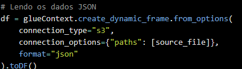
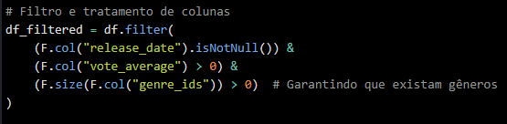
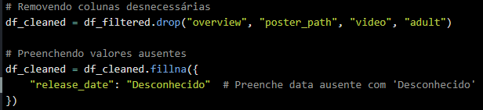
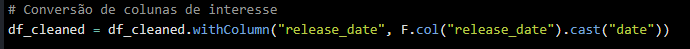
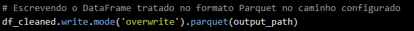
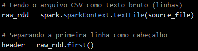
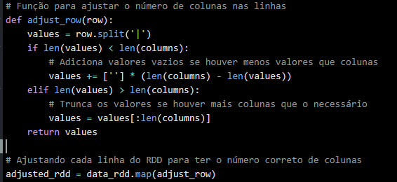
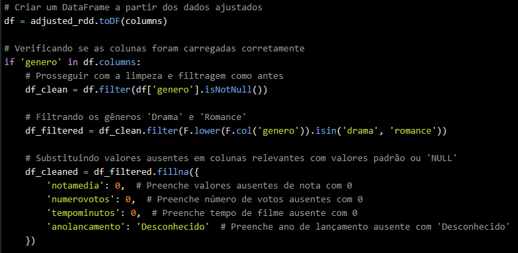
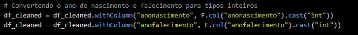
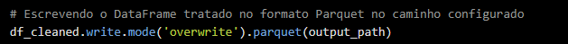

### Resumo e Explicação Detalhada dos Códigos

Ambos os códigos são responsáveis por processar arquivos, sendo o primeiro um arquivo JSON (proveniente da API do TMDB), e o segundo um arquivo CSV. Abaixo segue uma explicação detalhada de cada um.

---

### **Código 1: Processamento de Arquivo JSON (TMDB)**

Este código foi utilizado para processar um arquivo JSON contendo dados de filmes. Ele lê, filtra, limpa e grava os dados tratados em um bucket S3, no formato **Parquet**, usando o **AWS Glue** para orquestração e o **PySpark** para processamento dos dados.

#### Passos:

1. **Importações e Inicialização**:
    
    - O código importa bibliotecas relevantes do AWS Glue e PySpark, que são usadas para ler, transformar e gravar os dados.
    - `getResolvedOptions` é utilizado para capturar parâmetros passados ao job via linha de comando, como os caminhos de entrada e saída no S3 e o nome do job.
    - O `SparkContext` e `GlueContext` são criados, e o job do Glue é inicializado.
2. **Leitura do JSON**:
    
    - O arquivo JSON é lido diretamente do bucket S3, utilizando `glueContext.create_dynamic_frame.from_options`. Em seguida, os dados são convertidos para um DataFrame PySpark para facilitar o processamento.

    
    --------------
3. **Filtragem dos Dados**:
    
    - O DataFrame é filtrado para manter apenas os registros que:
        - Têm uma data de lançamento (`release_date`) não nula.
        - Possuem uma média de votos (`vote_average`) maior que 0.
        - Contêm gêneros (`genre_ids`), verificando se a lista de IDs de gênero não está vazia.

        
        ------------
4. **Limpeza dos Dados**:
    
    - Colunas irrelevantes, como `overview`, `poster_path`, `video`, e `adult` são removidas, para otimizar o tamanho e focar nas informações necessárias.
    - Valores nulos na coluna de data de lançamento são substituídos pela string `'Desconhecido'`.

    
    -----------------
5. **Conversão de Tipos**:
    
    - A coluna `release_date` é convertida para o tipo `date`, garantindo que datas sejam interpretadas corretamente no sistema.

    
    ------------------
6. **Escrita dos Dados**:
    
    - Os dados limpos e filtrados são gravados no formato **Parquet**, no caminho de saída especificado, utilizando o modo `overwrite` (sobrescreve o que estiver presente no caminho).

    
    ------------------
7. **Finalização do Job**:
    
    - O job do Glue é finalizado com o commit.

#### Explicação Técnica:

- **AWS Glue**: Serve como orquestrador de jobs de ETL (Extract, Transform, Load), facilitando a leitura e gravação de dados no S3.
- **PySpark**: Biblioteca usada para manipular grandes volumes de dados distribuídos de forma eficiente.
- **Parquet**: Um formato de arquivo altamente eficiente, otimizado para consultas e análises.

---

### **Código 2: Processamento de Arquivo CSV**

Este código realiza o processamento de um arquivo CSV contendo informações de filmes. Ele aplica transformações semelhantes ao código anterior, como limpeza de dados e filtragem por gênero, mas desta vez em um arquivo CSV que utiliza um delimitador de colunas customizado.

#### Passos:

1. **Importações e Inicialização**:
    
    - As bibliotecas do AWS Glue e PySpark são novamente importadas.
    - O código começa capturando os parâmetros de entrada e saída do job, além do nome do job.
    - Um `SparkContext` e `GlueContext` são iniciados, e o job é configurado.
2. **Leitura do CSV**:
    
    - O arquivo CSV é lido como um RDD de linhas de texto bruto (utilizando `textFile`).
    - A primeira linha do arquivo, que contém os cabeçalhos das colunas, é separada e usada para definir os nomes das colunas.
    
    
    ---------------
    
3. **Ajuste de Colunas**:
    
    - Uma função chamada `adjust_row` garante que cada linha tenha o número correto de colunas (com base no cabeçalho). Se uma linha tiver menos colunas, são adicionados valores vazios, e se tiver mais, os valores extras são truncados.

    
    ----------------
4. **Conversão para DataFrame**:
    
    - O RDD ajustado é convertido para um DataFrame com as colunas definidas pelo cabeçalho.
    - Caso a coluna `genero` esteja presente, o código continua com a limpeza e filtragem.

    
    ----------------
5. **Limpeza e Filtros**:
    
    - Filtra-se o DataFrame para manter apenas linhas com valores não nulos na coluna `genero`.
    - Em seguida, filtra-se para os gêneros de interesse, como `'drama'` e `'romance'`.
    - Valores ausentes em colunas relevantes, como `notamedia`, `numerovotos`, e `anolancamento` são preenchidos com valores padrão, como `0` ou `'Desconhecido'`.
6. **Conversão de Tipos**:
    
    - Colunas de ano, como `anonascimento` e `anofalecimento`, são convertidas para inteiros, garantindo a integridade dos dados.

    
    ----------------
7. **Escrita dos Dados**:
    
    - O DataFrame é gravado no formato **Parquet**, utilizando o modo `overwrite` para sobrescrever os dados no caminho de saída.

    
    ----------------
8. **Finalização do Job**:
    
    - O job é finalizado com `job.commit()`.

#### Explicação Técnica:

- **Tratamento de CSV**: Ao lidar com CSVs, é necessário cuidar de problemas como linhas mal formadas (com mais ou menos colunas do que o esperado), delimitadores customizados, e valores ausentes.
- **RDD**: PySpark permite a leitura de dados em formatos distribuídos utilizando RDDs, que podem ser transformados em DataFrames para facilitar operações mais complexas.
- **Parquet**: Assim como no código anterior, o formato Parquet é usado para armazenar os dados tratados de maneira eficiente.

---

